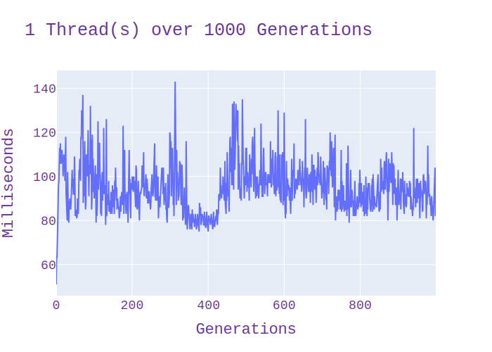

# Wa-tor Concurrency Research Report

Author: David Darigan
Student Number: C00263218
Repository: https://www.github.com/AlexDarigan/Wa-Tor

## Introduction

Taken from Wikipedia

    Wa-Tor(https://en.wikipedia.org/wiki/Wa-Tor) is a population dynamics simulation devised by A. K. Dewdney[1] and presented in the December 1984 issue of Scientific American in a five-page article entitled "Computer Recreations: Sharks and fish wage an ecological war on the toroidal planet Wa-Tor".

    Wa-Tor is usually implemented as a two-dimensional grid with three colours, one for fish, one for sharks and one for empty water. If a creature moves past the edge of the grid, it reappears on the opposite side. The sharks are predatory and eat the fish. Both sharks and fish live, move, reproduce and die in Wa-Tor according to the simple rules defined below. From these simple rules, complex emergent behavior can be seen to arise.

This project implements Wa-Tor using [SFML](https://www.sfml-dev.org/) for the Graphical User Interface and [OpenMP](https://www.openmp.org/) to implement concurrent development.

## Device Information

This research was conducted using the following Device Information

    Architecture:            x86_64
    CPU op-mode(s):        32-bit, 64-bit
    Address sizes:         39 bits physical, 48 bits virtual
    Byte Order:            Little Endian
    CPU(s):                  8
    On-line CPU(s) list:   0-7
    Vendor ID:               GenuineIntel
    Model name:            11th Gen Intel(R) Core(TM) i5-1155G7 @ 2.50GHz
        CPU family:          6
        Model:               140
        Thread(s) per core:  2
        Core(s) per socket:  4
        Socket(s):           1
        Stepping:            2
        CPU max MHz:         4500.0000
        CPU min MHz:         400.0000
        BogoMIPS:            4992.00
        Flags:               fpu vme de pse tsc msr pae mce cx8 apic sep mtrr pge mc
                            a cmov pat pse36 clflush dts acpi mmx fxsr sse sse2 ss 
                            ht tm pbe syscall nx pdpe1gb rdtscp lm constant_tsc art
                            arch_perfmon pebs bts rep_good nopl xtopology nonstop_
                            tsc cpuid aperfmperf tsc_known_freq pni pclmulqdq dtes6
                            4 monitor ds_cpl vmx est tm2 ssse3 sdbg fma cx16 xtpr p
                            dcm pcid sse4_1 sse4_2 x2apic movbe popcnt tsc_deadline
                            _timer aes xsave avx f16c rdrand lahf_lm abm 3dnowprefe
                            tch cpuid_fault epb cat_l2 invpcid_single cdp_l2 ssbd i
                            brs ibpb stibp ibrs_enhanced tpr_shadow vnmi flexpriori
                            ty ept vpid ept_ad fsgsbase tsc_adjust bmi1 avx2 smep b
                            mi2 erms invpcid rdt_a avx512f avx512dq rdseed adx smap
                            avx512ifma clflushopt clwb intel_pt avx512cd sha_ni av
                            x512bw avx512vl xsaveopt xsavec xgetbv1 xsaves split_lo
                            ck_detect dtherm ida arat pln pts hwp hwp_notify hwp_ac
                            t_window hwp_epp hwp_pkg_req avx512vbmi umip pku ospke 
                            avx512_vbmi2 gfni vaes vpclmulqdq avx512_vnni avx512_bi
                            talg avx512_vpopcntdq rdpid movdiri movdir64b fsrm avx5
                            12_vp2intersect md_clear ibt flush_l1d arch_capabilitie
                            s
    Virtualization features: 
    Virtualization:        VT-x
    Caches (sum of all):     
    L1d:                   192 KiB (4 instances)
    L1i:                   128 KiB (4 instances)
    L2:                    5 MiB (4 instances)
    L3:                    8 MiB (1 instance)
    NUMA:                    
    NUMA node(s):          1
    NUMA node0 CPU(s):     0-7
    Vulnerabilities:         
    Gather data sampling:  Mitigation; Microcode
    Itlb multihit:         Not affected
    L1tf:                  Not affected
    Mds:                   Not affected
    Meltdown:              Not affected
    Mmio stale data:       Not affected
    Retbleed:              Not affected
    Spec rstack overflow:  Not affected
    Spec store bypass:     Mitigation; Speculative Store Bypass disabled via prctl
    Spectre v1:            Mitigation; usercopy/swapgs barriers and __user pointer
                            sanitization
    Spectre v2:            Mitigation; Enhanced IBRS, IBPB conditional, RSB fillin
                            g, PBRSB-eIBRS SW sequence
    Srbds:                 Not affected
    Tsx async abort:       Not affected

## Charts

### Run Charts

Each of the following charts track the duration in milliseconds on the y-axis
per generation (one game loop) on the x-axis, for their thread count.

__Running with a Single Thread__

Thread Count: 1

There is an exceptional speed up from generation 300 to generation 500. The most likely cause
is a significant reduction in the fish population freeing up memory.

__Running with Two Threads__

Thread Count: 2

The highest point here was just a little over 80, granting us about a 50-60 millisecond speed up from
the single-threaded's count of 140

__Running with Four Threads__

Thread Count: 4

The standard rate for four threads is significantly lower compared to the previous two charts. However there is a
sequence of sudden jumps to 80. This is most likely due to the mutex locks around the edges of the grid.

__Running with Eight Threads__

Thread Count: 8

The max number of threads on the device used for this research was 8. We can see it starting to slow-down because threads are throttling each other. Despite this, there is still marginal improvement over the single threaded iterations.

__Conclusion__

Four threads, with the aforementioned device, seem to be ideal for this project.

### All Times Per Thread Count

This is a side-by-side comparison of the max, min and average times per thread.

The maximum time siginificantly drops as multi-threading enables but there seems to be no further gains with additional threads.

The average time drops once multithreaded enabled, and drops siginificantly again once four threads are enabled, however
it starts to rise as threads are increased.

The minimum time significantly drops off and it doesn't start to rise with more threads once it hits eight threads. This indicates that in the best-case scenario, 8 threads always comes out on top. However with threading involved, it
is far more likely that the consistently well-performing average speed of four threads is the best optimization.

The following charts show the same information presented differently

### Maximum Time Per Thread

### Minimum Time Per Thread

### Average Time Per Thread

## Notes

All code other than initialization, draw and the time code were measured.

- Initialize was only run once so there wouldn't be any gains to be made

- OpenGL (which powers) SFML's draw is not thread-safe. The draw function takes close to 400 milliseconds ultimately
negating the gain. OpenGL will raise an error about trying to draw in a threaded enviroment and we can't draw while
also buffing the map (the two acts must be sequential to other)

- rand() uses mutexes lock on it's internal state that tracks randomness. This siginificantly slowed that data down. rand48() replaced it. rand48() does not use locks, and some methods expose the state that holds the randomness value
so each thread can have it's own local copy. Previous to this change, any multithreaded version was acting as a
single threaded version.

# Conclusion

The general consensus of this report seems to indicate that four threads is ideal for the speed up (on the particular
device aforementioned in CPU Information). The biggest issue with the gains is that it isn't enough to overcome the
real slowdown that's part of the SFML graphics library.